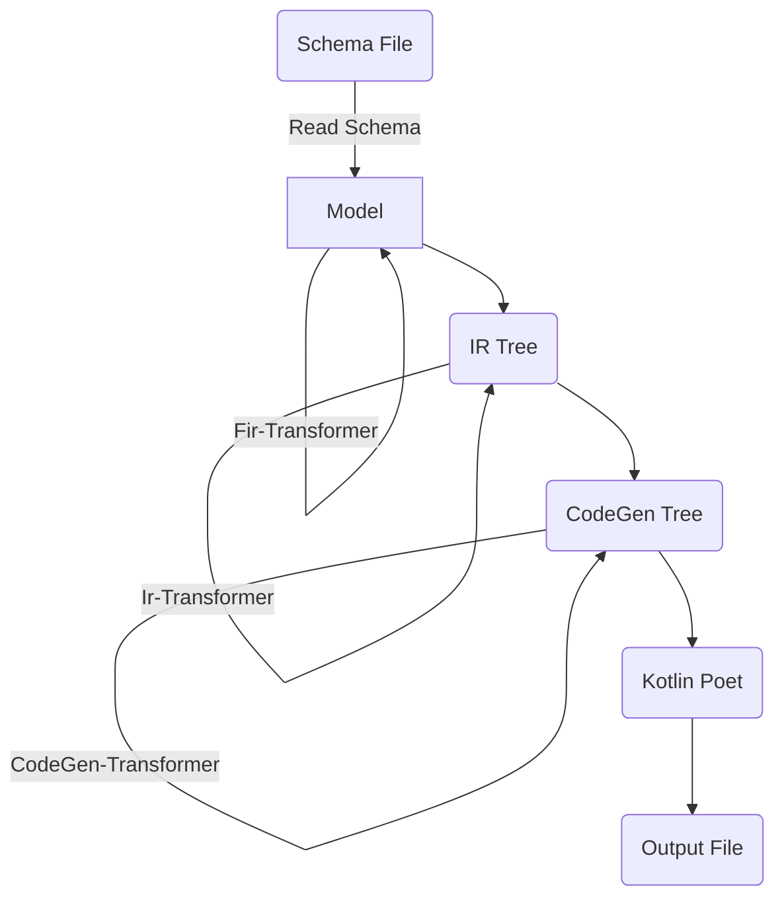

# kfx

Generate code from supported API formats.

kfx parses API files, transforms them into an intermediate representation (IR) and uses a code generator to actually
create the code by consuming the IR.

kfx supports some API formats and code generators out of the box, but due to its plugin mechanisms it's easy to support
other api formats or code generators too.

## What's included

API formats:

- WSDL (including XSD)
- Swagger
- OpenAPI

Code generators:

- Kotlin using Kotlinx.serialization
- Ktor client functions

## Gradle plugin

```kotlin
plugins {
    id("io.github.hfhbd.kfx") version "LATEST"
}

kfx {
    register("myApi", OpenApi::class) {
        files.from(file("myApi.json"))
        dependencies {
            compiler(kotlin())
            compiler(kotlinxJson())
            compiler(ktorClient())
        }
        sourceSets.main {
            usingSourceSet(kotlin)
        }
    }
}
```

To generate code, you need to call register/create and configure the compilation.
In the dependencies block, you define what code should be generated: 
- kotlin: Kotlin classes only
- kotlinxJson: Adds `@Serializable` annotation to Kotlin classes
- ktorClient: Generates ktor client functions
- ktorServer: Generates ktor server `Route` functions

You also need to call `usingSourceSet` to connect the generated code to a Gradle SourceSet.

## Custom Transformer

Often, api files need some transformation, to change the Kotlin type, to add some documentation or custom types, or just
to fix some wrong apis until a new version will be released.

There are three kind of transformers, format specific ones, IR transformers and code gen transformers.
The transformers are loaded using JVM ServiceLoader mechanism and needs to be added to the format dependency
configuration.


