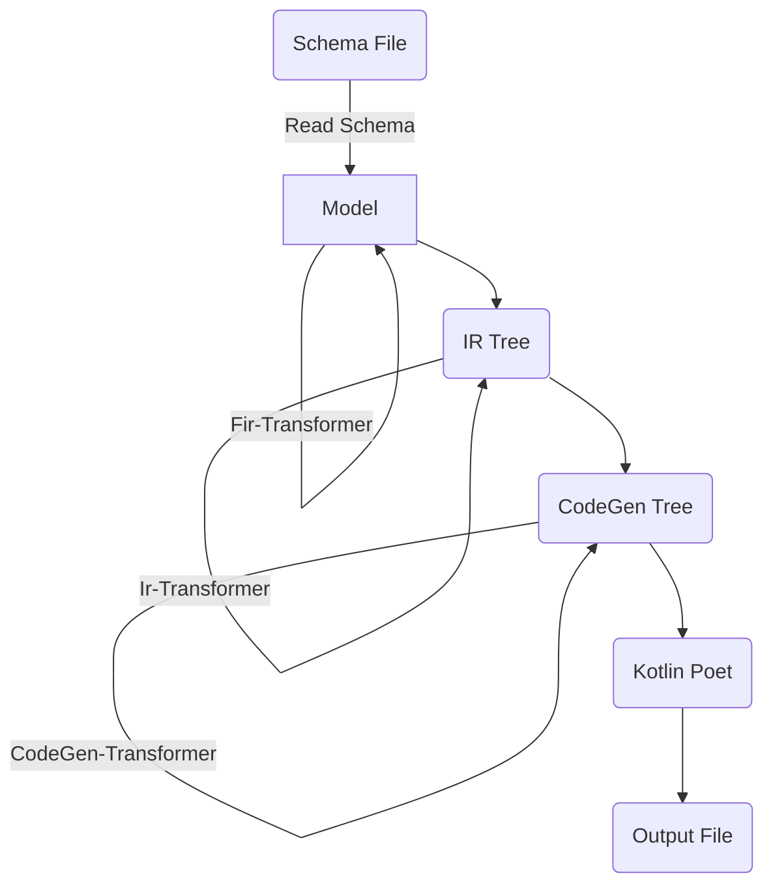

# kfx

Generate code from supported API formats.

kfx parses API files, transforms them into an intermediate representation (IR) and uses a code generator to actually
create the code by consuming the IR.

kfx supports some API formats and code generators out of the box, but due to its plugin mechanisms it's easy to support
other api formats or code generators too.

## What's included

API formats:

- WSDL (including XSD)
- Swagger
- OpenAPI

Code generators:

- Kotlin using Kotlinx.serialization
- Ktor client functions

## Gradle plugin

For each built-in api format, there is a specific Gradle plugin named `io.github.hfhbd.kfx.FORMAT`,
adding `kfxFORMAT` dependency configuration:

```kotlin
plugins {
    id("io.github.hfhbd.kfx.wsdl") version "LATEST"
}

dependencies {
    // add the code generators as dependencies
    kfxWsdl("io.github.hfhbd.kfx:kotlin:LATEST") // for Kotlin classes only
    kfxWsdl("io.github.hfhbd.kfx:ktor-client:LATEST") // for Ktor clients, also includes kotlin
}
```

## Custom Transformer

Often, api files need some transformation, to change the Kotlin type, to add some documentation or custom types, or just
to fix some wrong apis until a new version will be released.

There are three kind of transformers, format specific ones, IR transformers and code gen transformers.
The transformers are loaded using JVM ServiceLoader mechanism and needs to be added to the format dependency
configuration.


